# Sort Dash: Bubble Sort Learning Game

**Author:** Justin Duggan


**Short description:** An interactive Gradio app that visualizes Bubble Sort step-by-step and includes a practice and prediction game where users guess how many swaps Bubble Sort will perform on a list.


## Demo/Testing
The Bubble Sort Learning Game was thoroughly tested to ensure correctness across different modes and input scenarios. Below is a summary of the tests performed and their outcomes:

1. Array Inputs Tested
Random arrays: Lengths 5–15, values 1–60. Both Tutorial and Practice modes correctly display comparisons, swaps, and the “bubbling” element.

Edge cases:
Already sorted array – no swaps occur; tutorial highlights correctly.
Reverse-sorted array – maximum swaps occur; practice mode enforces rules.
Arrays with repeated values – swaps happen only when left > right; scoring accounts for duplicates.
Single-element or empty array – handled gracefully without errors.

**Random Array Example:**  
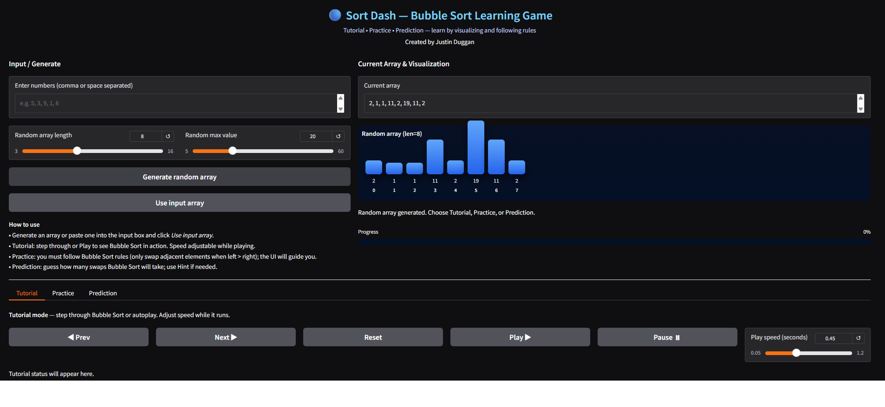

Already sorted array example:  
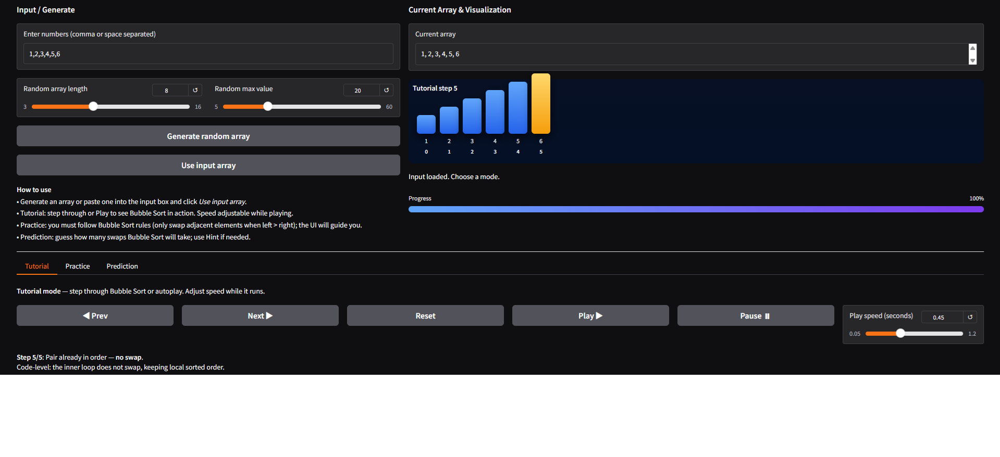

Reverse-sorted array example:  
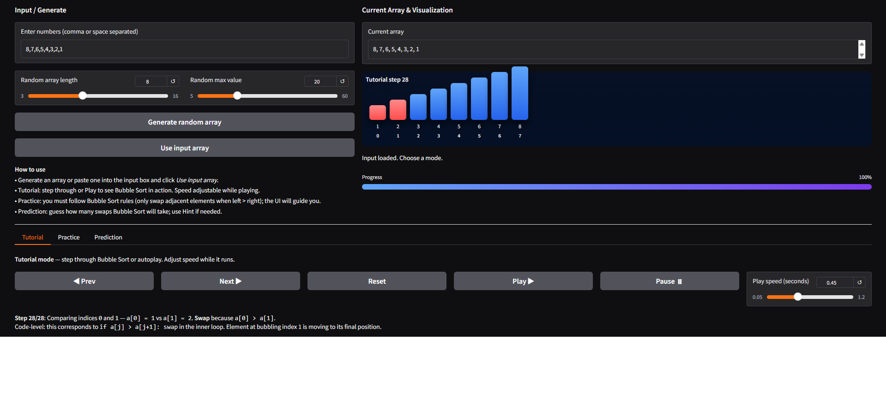

Repeated values example:  
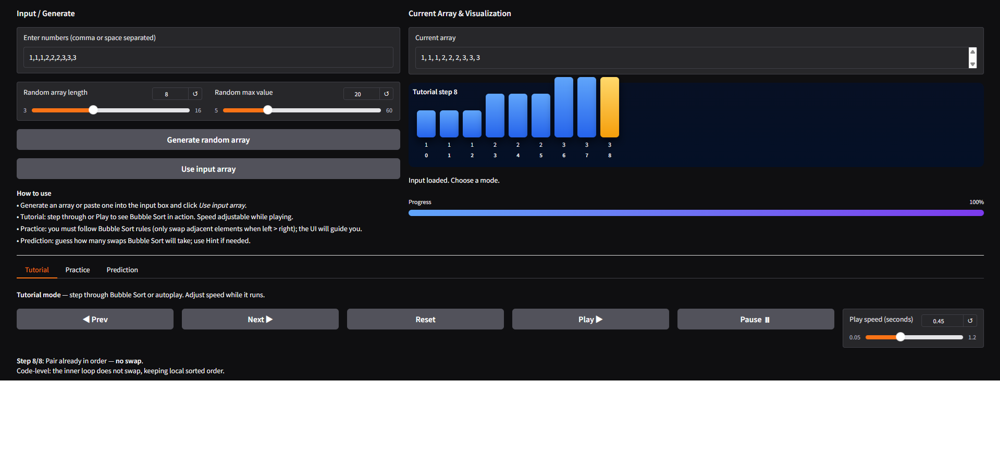

Trivial/single-element array example:  
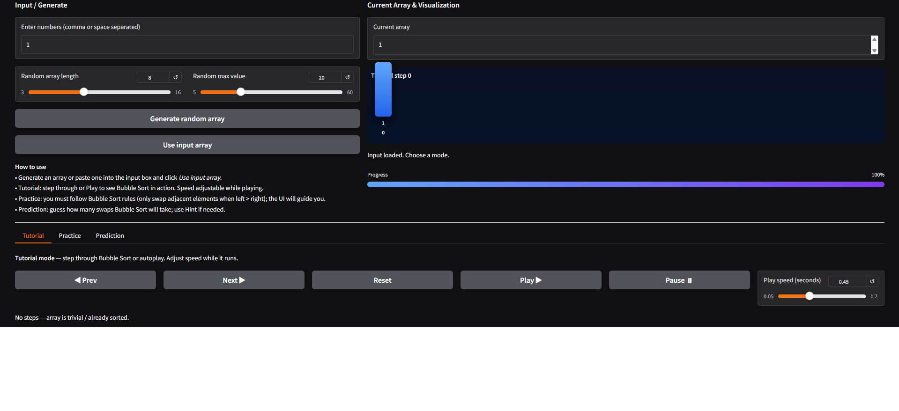


2. Tutorial Mode
Step-through functionality: Next, Prev, Play, Pause all work correctly.
Correct highlighting of compared pair and bubbling index.
Progress bar accurately reflects tutorial progress.
Example screenshot:

Shows initial array and first pair being compared.

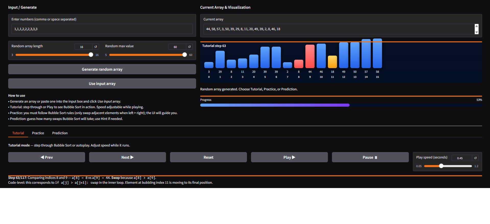

3. Practice Mode
Swap allowed only when left > right.
Feedback messages correctly appear when swap is allowed or forbidden.
Practice moves counted accurately; final scoring reflects optimal swaps.
Example screenshot:

Shows a swap being performed at the correct indices.

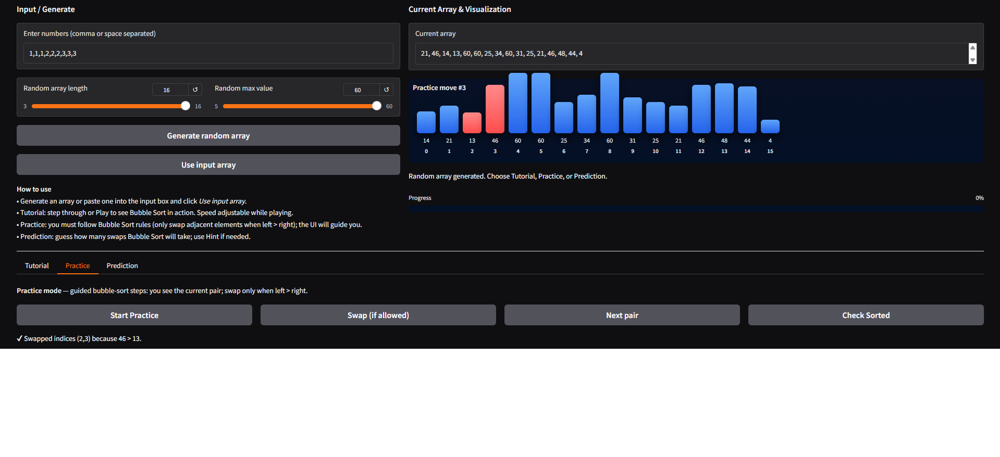

Example screenshot (swap disallowed):

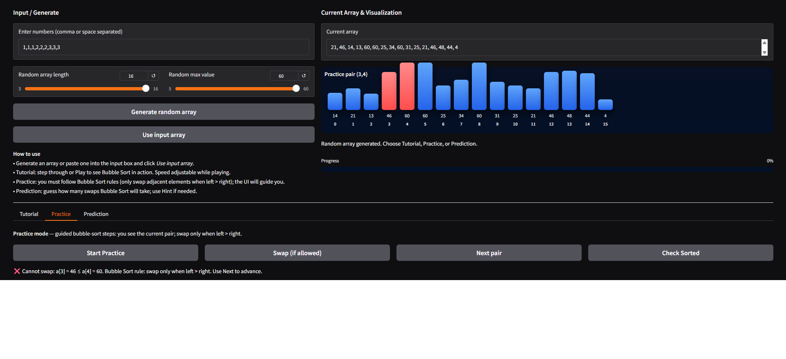

Example screenshot (final sorted check):

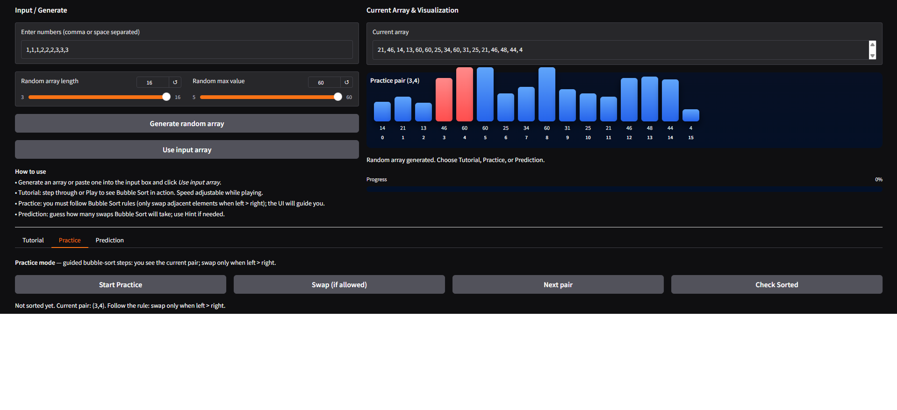

4. Prediction Mode
User guesses vs actual swap count verified.
Hint system provides useful guidance based on inversion count.
Accuracy scoring correctly calculated as a percentage.

Example screenshot:

Shows user prediction, actual swaps, and score badge.

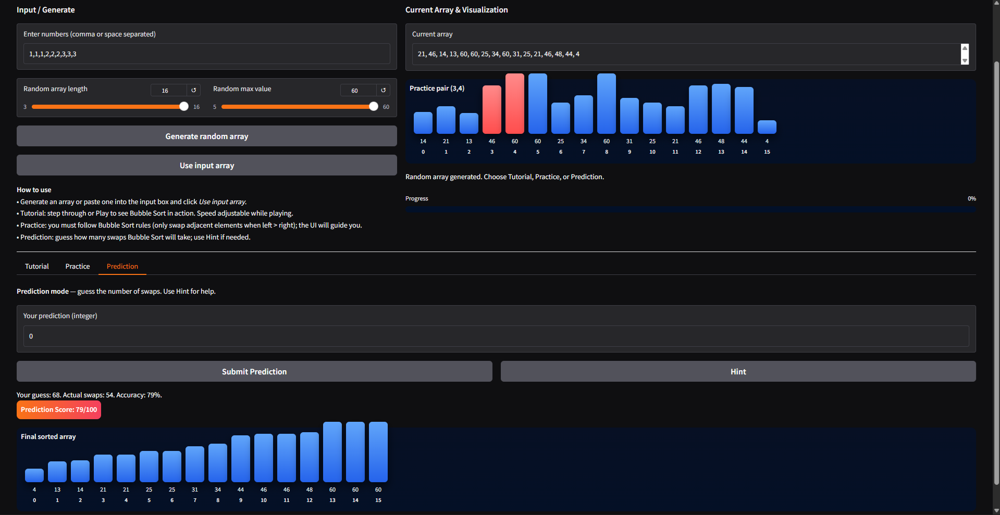

Example screenshot (hint shown):

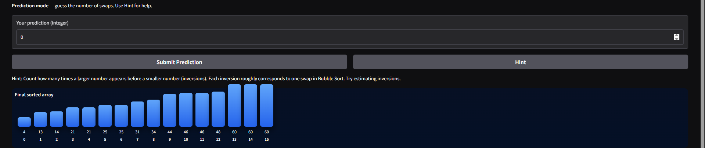

5. GUI Verification
Gradients indicate swap comparisons and bubbling elements.
Progress bars update dynamically.
Disabled sound effects for compatibility with Gradio 6.x.
Delay slider affects tutorial speed as intended.

6. Notes on Adjustments
Sound effects were attempted but later removed due to compatibility issues.
Minor tweaks were made to accommodate dynamic delays in tutorial mode and ensure smooth playback in Gradio 6.x.


## Problem Breakdown & Computational Thinking


### Chosen algorithm
**Bubble Sort** — chosen for its clarity when visualizing comparisons and adjacent swaps. It is easy to illustrate the repeated compare-and-swap pattern and produces measurable swap counts for the mini-game.

Bubble Sort was chosen for this project for educational purposes:
- It is simple and intuitive, making it ideal for visualizing and learning sorting mechanics.
- Its step-by-step comparison and swap operations allow users to see clear cause-and-effect relationships in an algorithm.
- Bubble Sort aligns well with computational thinking practices, such as decomposition, pattern recognition, and algorithmic design.

### Decomposition

Bubble Sort is broken into smaller steps:
Start at the beginning of the array.
Compare adjacent elements (a[j], a[j+1]).
If a[j] > a[j+1], swap them.
Move to the next adjacent pair (j+1, j+2).
Repeat until the end of the array for one pass.
Repeat passes until the array is sorted (no swaps occur in a pass).

- Input parsing (text ➜ integer list)
- Generating a random list for demo
- Prediction game logic (user guesses swap count) and scoring


### Pattern recognition
Bubble sort repeatedly compares adjacent elements and moves larger elements "bubbling" to the end. The core repeated pattern is: compare a[j] and a[j+1], swap if out of order.

The algorithm repeatedly traverses the array from start to end.
Each pass "bubbles" the largest unsorted element to its correct position.
Comparisons and swaps follow a predictable pattern: only adjacent elements are compared, and swaps occur only if the left element is larger than the right.


### Abstraction
Shown to the user:
The current array state as bars with heights proportional to values.
The current pair being compared highlighted in red.
The largest element "bubbling" to its correct position highlighted in yellow.
Step counts, moves, and scoring for Practice and Prediction modes.

Discarded / hidden from user:
Low-level loop indices, temporary variables used in swaps, or internal Python mechanics.
Full internal list copies on every step (used internally for animation but not exposed in detail).


### Algorithm Design
Input (user list or generated list) → bubble_sort_steps generator → sequence of frames → UI displays frames (or joined playback) → (optional) prediction game runs to compute actual swaps and score

Algorithm Design: Input → Processing → Output

Input:
User-provided array (string of integers separated by commas or spaces), or a randomly generated integer list.
Datatype: List[int].

Processing:
1. Validate and parse the input array.
2.Compute Bubble Sort steps internally, storing:
Array states at each step.
Swap operations.
Current bubbling element index.
3. Track user interactions in Practice mode:
Swap actions.
Next-pair advancement.
Scoring based on correct Bubble Sort moves.
4. Predict swaps for Prediction mode using internal Bubble Sort computation.

Output (via GUI):
Dynamic visualization of array bars with highlights.
Status messages explaining comparisons, swaps, or rules.
Progress bar showing completion percentage.
Practice mode scoring and hints.
Prediction mode scoring and hints.


Flowchart Diagram (ASCII example)
+------------------+
| User inputs array|
+--------+---------+
         |
         v
+------------------+
| Parse & validate |
+--------+---------+
         |
         v
+----------------------------+
| Bubble Sort computation    |
| (store frames & swaps)     |
+--------+-------------------+
         |
         v
+----------------------------+
| GUI displays visualization |
| - Current pair highlight   |
| - Bubbling element         |
| - Status messages          |
+--------+-------------------+
         |
         v
+----------------------------+
| Practice & Prediction modes|
| - Accept swaps / Next pair |
| - Compute scores           |
+----------------------------+


## Steps to run (local)
1. Create a virtual environment (recommended):
```bash
python -m venv venv
source venv/bin/activate # Linux/Mac
venv\Scripts\activate # Windows


2. Install dependencies:
pip install -r requirements.txt


3. Run the app locally:
python app.py


4. Open the provided local URL (or the Hugging Face URL after deployment) and interact with the app.


## Hugging Face Link
https://huggingface.co/spaces/JustinD2025/Sort-Dash


## Author & Acknowledgment
Author: Justin Duggan


AI Acknowledgement

This project was developed with the assistance of Level 4 AI (GPT-5 mini). The AI was used in the following ways:

Code Generation and Completion: Assisted in writing Python functions for the Bubble Sort algorithm, including tutorial step-by-step logic, practice mode enforcement, prediction scoring, and array visualization in HTML/CSS.

Algorithm Planning Guidance: Helped outline computational thinking steps such as decomposition, pattern recognition, abstraction, and algorithm design, ensuring that the implementation aligned with learning objectives.

Documentation and README Drafting: Provided explanations, structured documentation, and examples of flowcharts and visual guides for clarity and readability.

UI Design Advice: Suggested user interface elements and visualization strategies, including bar highlighting, progress indicators, and clear messaging for practice and tutorial modes.

The AI acted as a collaborative coding assistant, offering suggestions, generating initial code templates, and providing guidance. All final code, logic decisions, and design choices were reviewed, modified, and approved by myself - the human in the loop.